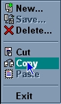



## Menu Replacement

### Description

Have you ever wanted to use your own custom menu instead of the one that comes with windows? You know, those little popup menus you get when you right-click on something, well, I've made a replacement for them (All source included). It lets you make a popup menu animated like the windows ones, but fully customizable. There is the .ocx source and a demo program that uses the menu.ocx to display an example menu. The code is commented and not too hard to understand. If you like the code please vote or leave comments.

-Daniel Taylor (Dan@nknet.com)

*This is a complete user-drawn menu** i don't use the windows popup menu at ALL...* The screenshot below just shows how closesly it can resemble the windows popupmenu, the colors are fully customizable, and so is the border...**
 
### More Info
 

             |
---                |---
**Submitted On**   |2001-04-17 20:31:48
**By**             |[Daniel Taylor](https://github.com/Planet-Source-Code/PSCIndex/blob/master/ByAuthor/daniel-taylor.md)
**Level**          |Intermediate
**User Rating**    |4.4 (22 globes from 5 users)
**Compatibility**  |VB 4\.0 \(32\-bit\), VB 5\.0, VB 6\.0
**Category**       |[OLE/ COM/ DCOM/ Active\-X](https://github.com/Planet-Source-Code/PSCIndex/blob/master/ByCategory/ole-com-dcom-active-x__1-29.md)
**World**          |[Visual Basic](https://github.com/Planet-Source-Code/PSCIndex/blob/master/ByWorld/visual-basic.md)
**Archive File**   |[Menu Repla184974172001\.zip](https://github.com/Planet-Source-Code/daniel-taylor-menu-replacement__1-22488/archive/master.zip)

